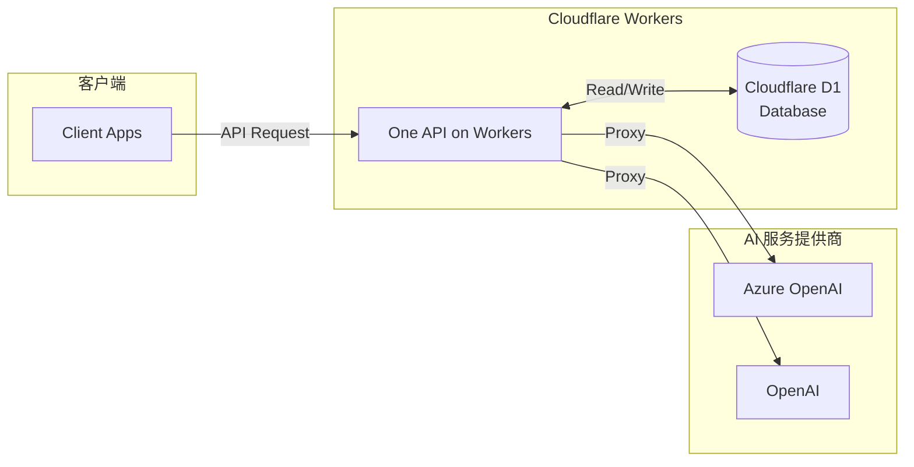

# One API on Workers

一个基于 Cloudflare Workers 的 OpenAI API 代理服务，支持多渠道管理、Token 管理和使用量统计。

## ✨ 特性

- 🚀 **基于 Cloudflare Workers**：无服务器架构，全球边缘部署
- 🔐 **多渠道支持**：支持 OpenAI、Azure OpenAI、Claude、OpenAI Responses、Azure OpenAI Responses
- 🎫 **Token 管理**：完整的 API Token 生成、管理和配额控制
- 📊 **使用量统计**：实时统计 API 使用量和费用
- 💰 **定价管理**：灵活的模型定价配置
- 🎨 **Web 管理界面**：直观的 Web 界面进行配置管理
- 🧪 **API 测试工具**：内置 API 测试功能，支持实时调试
- 📚 **OpenAPI 文档**：自动生成的 API 文档

## 🏗️ 系统架构



<details>
<summary><h2>📁 项目结构</h2></summary>

```text
one-api-workers/
├── src/                          # 源代码目录
│   ├── admin/                    # 管理接口
│   │   ├── channel_api.ts        # 渠道管理 API
│   │   ├── token_api.ts          # Token 管理 API
│   │   ├── pricing_api.ts        # 定价管理 API
│   │   ├── db_api.ts             # 数据库初始化 API
│   │   └── index.ts              # 管理接口路由
│   ├── providers/                # AI 服务提供商
│   │   ├── azure-openai-proxy.ts # Azure OpenAI 代理
│   │   ├── openai-proxy.ts       # OpenAI 代理
│   │   ├── claude-proxy.ts       # Claude 代理
│   │   ├── openai-responses-proxy.ts # OpenAI Responses 代理
│   │   ├── azure-openai-responses-proxy.ts # Azure Responses 代理
│   │   └── index.ts              # 提供商路由
│   ├── db/                       # 数据库相关
│   ├── model/                    # 数据模型
│   ├── constants.ts              # 常量定义
│   ├── utils.ts                  # 工具函数
│   └── index.ts                  # 主入口文件
├── public/                       # 静态文件
│   └── index.html                # Web 管理界面
├── type.d.ts                     # 类型定义
├── wrangler.jsonc                # 生产/部署配置
├── wrangler.local.jsonc          # 本地开发配置
└── package.json                  # 项目配置
```

</details>

## 🚀 快速开始

### 环境要求

- Bun 1.3+
- Cloudflare Workers 账户

### 安装依赖

```bash
bun install
```

仓库已配置为 Bun workspaces，根目录一次安装会同时安装 Worker 和 `frontend/` 的依赖。

### 配置环境

1. 修改 `wrangler.jsonc`，用于生产部署：

```jsonc
{
  "$schema": "node_modules/wrangler/config-schema.json",
  "name": "one-api-workers",
  "main": "src/index.ts",
  "compatibility_date": "2025-04-28",
  "workers_dev": false,
  "vars": {
    "ADMIN_TOKEN": "your-secure-admin-token-here"
  },
  "assets": {
    "directory": "./public",
    "binding": "ASSETS",
    "run_worker_first": true
  },
  "d1_databases": [
    {
      "binding": "DB",
      "database_name": "your-database-name",
      "database_id": "your-database-id"
    }
  ]
}
```

2. 修改 `wrangler.local.jsonc`，用于本地开发：

```jsonc
{
  "$schema": "node_modules/wrangler/config-schema.json",
  "name": "one-api-workers",
  "main": "src/index.ts",
  "compatibility_date": "2025-04-28",
  "workers_dev": false,
  "vars": {
    "ADMIN_TOKEN": "your-local-admin-token",
    "FRONTEND_DEV_SERVER_URL": "http://127.0.0.1:5173"
  }
}
```

3. 创建 Cloudflare D1 数据库：

```bash
wrangler d1 create one-api-workers
```

4. 在 Cloudflare Dashboard 中手动绑定生产域名：

1. 进入 `Workers & Pages`
2. 选择当前 Worker
3. 打开 `Settings > Domains & Routes`
4. 选择 `Add > Custom Domain`
5. 添加你的生产域名

如果你选择在 Dashboard 管理生产域名，就不要再把 `routes` / `custom_domain` 写回 `wrangler.jsonc`，否则下次 `wrangler deploy` 会用配置文件覆盖 Dashboard 中的路由设置。

### 本地开发

```bash
bun run dev
```

执行后会同时启动：

- 前端 Vite 开发服务器：`http://127.0.0.1:5173`（作为 Worker 的上游）
- Cloudflare Worker 本地服务：`http://127.0.0.1:8788`（浏览器访问入口）

Worker 会代理非 `/api/*`、`/v1/*` 的请求到本地 Vite dev server，因此本地联调时应访问 `http://127.0.0.1:8788`，而不是直接打开 `5173`。
这里不需要再给前端配置 Vite `server.proxy`，但仍然需要同时启动 Vite dev server，因为 HMR 和未构建源码都是由它提供，Worker 只是统一入口。
`bun run dev:worker` 会显式使用 `wrangler.local.jsonc`，并固定 `--host localhost`，避免本地开发被生产配置干扰。

如果只想单独调试后端，可运行：

```bash
bun run dev:worker
```

如果只想单独启动前端，可运行：

```bash
bun run dev:web
```

此模式只启动 Vite dev server，适合做纯前端样式开发；如果需要直接从 `5173` 调 API，请自行设置 `VITE_API_BASE_URL=http://127.0.0.1:8788`。

### 部署到生产环境

```bash
bun run deploy
```

部署前会自动构建前端资源到 `public/`。

<details>
<summary><h2>📖 使用与配置</h2></summary>

### 使用指南

#### 初始化数据库

系统会在首次访问需要数据库的接口时自动创建缺失表结构并补齐版本信息，通常不再需要手动初始化。

前端界面不再提供单独的数据库管理页。

#### 渠道配置

1. 访问 `https://your-domain.com`
2. 使用管理员 Token 登录
3. 进入 **🔗 渠道管理** 页面
4. 点击 **➕ 添加渠道** 按钮
5. 选择渠道类型（OpenAI、Azure OpenAI、Claude、Responses）
6. 填写渠道标识和配置信息（名称、端点、API 密钥、模型映射）
7. 点击 **💾 保存渠道** 按钮

**提示**：系统会根据选择的渠道类型自动显示相应的配置字段。

#### Token 创建和使用

1. 在 Web 界面切换到 **🔑 令牌管理** 标签
2. 点击 **➕ 添加令牌** 按钮
3. 填写令牌名称，系统会自动生成 `sk-` 开头的 Token
4. 配置允许访问的渠道和配额
5. 点击 **💾 保存令牌** 按钮
6. 使用 **📋 复制** 按钮获取 Token 用于 API 调用

#### OpenAI 兼容 API

本项目提供完全兼容的 OpenAI API 接口：

```bash
curl https://your-domain.com/v1/chat/completions \
  -H "Content-Type: application/json" \
  -H "Authorization: Bearer YOUR_API_TOKEN" \
  -d '{
    "model": "gpt-4",
    "messages": [
      {
        "role": "user",
        "content": "Hello, world!"
      }
    ]
  }'
```

#### Responses API（OpenAI / Azure）

```bash
curl https://your-domain.com/v1/responses \
  -H "Content-Type: application/json" \
  -H "Authorization: Bearer YOUR_API_TOKEN" \
  -d '{
    "model": "gpt-5.1-codex-max",
    "input": "Hello, Responses API!"
  }'
```

#### API 测试工具

管理界面内置了强大的 API 测试工具，无需额外工具即可进行 API 调试：

**功能特性**

- **🚀 一键测试**：直接在 Web 界面中测试 API 调用
- **📝 JSON 编辑器**：支持 JSON 格式验证和语法高亮
- **⚡ 实时响应**：显示响应时间、状态码和完整响应内容
- **🔍 错误诊断**：自动区分 HTTP 错误和 JSON 响应，便于排查问题
- **📋 一键复制**：支持复制 Token 和响应内容

**使用步骤**

1. 访问管理界面，切换到 **🧪 API 测试** 标签
2. 输入你的 API Token（可从令牌管理页面复制）
3. 编辑请求 JSON（预填充标准格式）
4. 点击 **🚀 发送请求** 按钮
5. 查看响应结果和状态信息

### 管理功能

#### Web 管理界面

访问 `https://your-domain.com` 即可使用 Web 管理界面，功能包括：

- **🔗 渠道管理**：添加、编辑、删除 AI 服务提供商渠道（支持 OpenAI、Azure OpenAI、Claude、OpenAI Responses、Azure Responses）
- **🔑 API Token 管理**：生成、管理和监控 API Token 使用情况
- **💰 定价配置**：灵活配置不同模型的定价策略
- **🧪 API 测试工具**：内置 API 测试界面，支持实时调试和错误排查

**管理界面特性**

- **现代化 UI**：响应式设计，支持桌面和移动设备
- **实时反馈**：操作结果即时显示，支持悬浮提示
- **智能表单**：自动生成 Token、JSON 格式验证、一键复制功能，根据渠道类型智能显示配置字段
- **安全认证**：管理员 Token 认证，数据安全保护

### 配置说明

#### 渠道配置

目前支持以下 AI 服务提供商：

**OpenAI 配置**

```json
{
  "name": "My OpenAI Channel",
  "type": "openai",
  "endpoint": "https://api.openai.com/v1/",
  "api_key": "sk-your-openai-api-key",
  "deployment_mapper": {
    "gpt-4": "gpt-4",
    "gpt-3.5-turbo": "gpt-3.5-turbo"
  }
}
```

**Azure OpenAI 配置**

```json
{
  "name": "My Azure OpenAI",
  "type": "azure-openai",
  "endpoint": "https://your-resource.openai.azure.com/",
  "api_key": "your-azure-api-key",
  "api_version": "2024-02-15-preview",
  "deployment_mapper": {
    "gpt-4": "gpt-4-deployment-name",
    "gpt-3.5-turbo": "gpt-35-turbo-deployment-name"
  }
}
```

**Claude 配置**

```json
{
  "name": "My Claude Channel",
  "type": "claude",
  "endpoint": "https://api.anthropic.com/v1/",
  "api_key": "sk-your-claude-api-key",
  "api_version": "2023-06-01",
  "deployment_mapper": {
    "claude-3-5-sonnet-20241022": "claude-3-5-sonnet-20241022"
  }
}
```

**OpenAI Responses 配置**

```json
{
  "name": "My OpenAI Responses",
  "type": "openai-responses",
  "endpoint": "https://api.openai.com/v1/",
  "api_key": "sk-your-openai-api-key",
  "deployment_mapper": {
    "gpt-5.1-codex-max": "gpt-5.1-codex-max"
  }
}
```

**Azure OpenAI Responses 配置（v1）**

```json
{
  "name": "My Azure Responses",
  "type": "azure-openai-responses",
  "endpoint": "https://your-resource.openai.azure.com/",
  "api_key": "your-azure-api-key",
  "deployment_mapper": {
    "gpt-5.1-codex-max": "your-deployment-name"
  }
}
```

**配置字段说明**：

- `name`: 渠道显示名称
- `type`: 服务提供商类型（`openai`、`azure-openai`、`claude`、`openai-responses`、`azure-openai-responses`）
- `endpoint`: API 端点地址
- `api_key`: API 密钥
- `api_version`: API 版本（Azure OpenAI / Claude 可用；Azure Responses v1 请留空）
- `deployment_mapper`: 模型名称映射关系（用于自定义模型名称映射）

### Token 配置

支持详细的 Token 配置，包括名称、访问权限和配额管理：

```json
{
  "name": "用户令牌1",
  "channel_keys": ["azure-openai-1", "azure-openai-2"],
  "total_quota": 1000000
}
```

**配置字段说明**：

- `name`: Token 名称，便于管理识别
- `channel_keys`: 允许访问的渠道列表，空数组表示允许所有渠道
- `total_quota`: 总配额（基础单位：1百万 token = $1.00）

### 监控与统计

- **使用量统计**：自动记录每次 API 调用的 Token 使用量
- **费用计算**：基于模型定价自动计算费用
- **配额管理**：支持 Token 级别的配额限制
- **实时监控**：Web 界面实时显示使用情况和剩余配额

### 核心优势

- **零配置部署**：基于 Cloudflare Workers，无需服务器维护
- **全球加速**：利用 Cloudflare 全球边缘网络，低延迟访问
- **成本优化**：按需计费，无固定服务器成本
- **高可用性**：Cloudflare 基础设施保证 99.9% 可用性
- **安全可靠**：内置 Token 认证和配额管理机制

### 安全性

- **Token 认证**：所有 API 调用需要有效的 Bearer Token
- **管理员认证**：管理接口使用独立的管理员 Token
- **CORS 支持**：配置跨域访问策略

### API 文档

部署后可访问以下地址查看完整 API 文档：

- Swagger UI: `https://your-domain.com/api/docs`
- ReDoc: `https://your-domain.com/api/redocs`
- OpenAPI JSON: `https://your-domain.com/api/openapi.json`

</details>

## 🤝 贡献

欢迎提交 Issue 和 Pull Request！

## 📄 许可证

MIT License

## 🙋‍♂️ 支持

如有问题或建议，请创建 Issue 或联系维护者。
